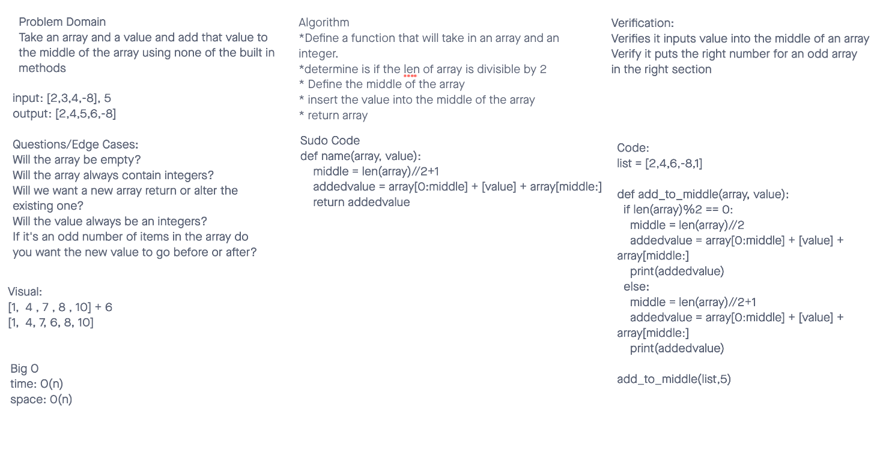

# Insert to Middle of an Array
<!-- Description of the challenge -->
Take an array and a value and add that value to the middle of the array using none of the built in methods

## Whiteboard Process
<!-- Embedded whiteboard image -->

## Approach & Efficiency
<!-- What approach did you take? Discuss Why. What is the Big O space/time for this approach? -->
Worked with Victor to get this done we started with our problem domain and followed from there. We did a bit of sudo code once we were done with question and visual. Then dived a bit into different ways of doing this after looking over google. Big 0 time is still o as well as space. 

