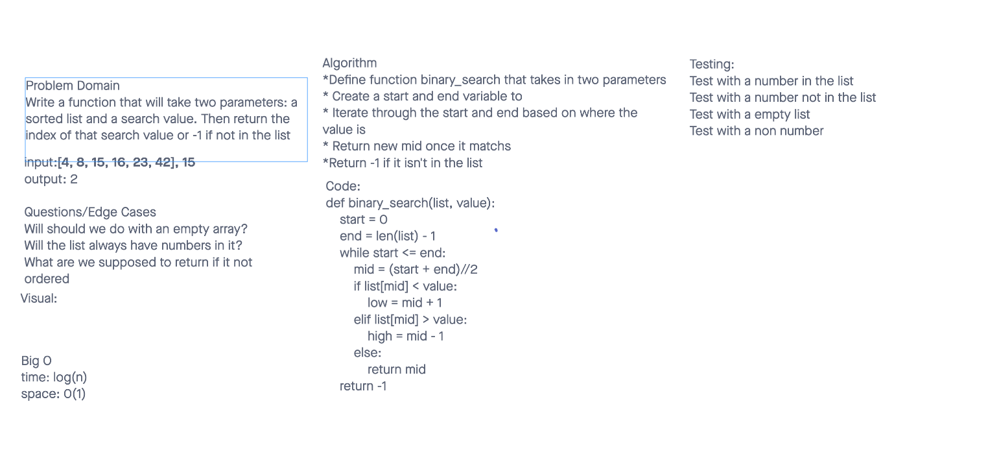

# Binary Search
<!-- Description of the challenge -->
Take a sorted array and a value and using binary search return the index of that value if that value is not in the array return -1

## Whiteboard Process
<!-- Embedded whiteboard image -->

## Approach & Efficiency
<!-- What approach did you take? Discuss Why. What is the Big O space/time for this approach? -->
Worked with Michael to get this done we started with our problem domain and followed from there. For the Big 0 Michael helped walk me through it since I was struggling but our time is log(n) due to the while loop that we are using and our space is still 0(n) since we aren't using any more space.

