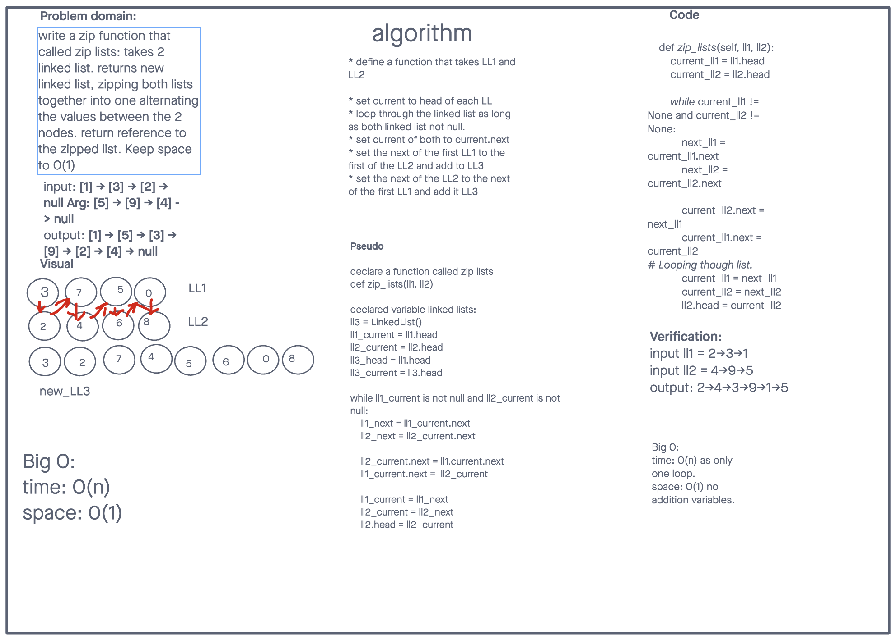

# Linked List Zip
<!-- Description of the challenge -->
Write a function that will take in two linked lists and then return a new linked list zipped starting with list 1 value one and alternating between the two lists until
no values are left

## Whiteboard Process
<!-- Embedded whiteboard image -->

## Approach & Efficiency
<!-- What approach did you take? Why? What is the Big O space/time for this approach? -->
Space: ?
Time: 0(n)

## Solution
<!-- Show how to run your code, and examples of it in action -->
Not quite sure how this section is different from my testing in the Whiteboard

This will take two linked list
ll1: {3} -> {5} -> {7} -> None
ll2: {4} -> {6} -> {8} -> None

Then Merge them into one new linked list with the values alternating starting with the first list

ll3: {3} -> {4} -> {5} -> {6} -> {7} -> {8} -> None

