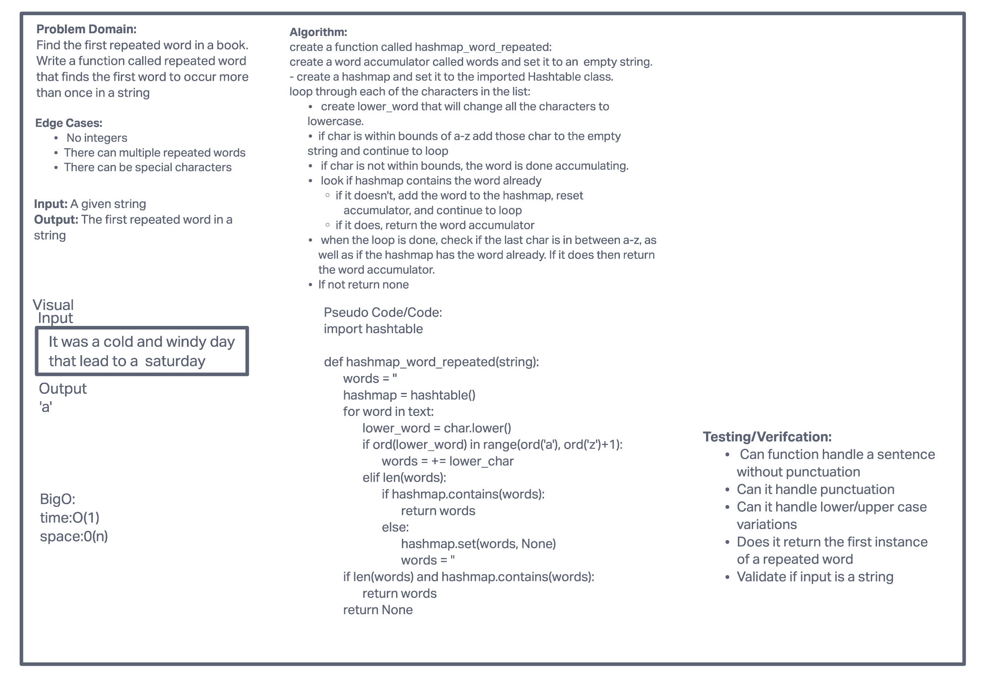

# Hash Tables
<!-- Short summary or background information -->
Create a Hashtable with 5 internal functions to implement that hashtable

## Challenge
<!-- Description of the challenge -->
Create a hashtable class that will be able to hash, set a key value pair, return a value based on the key, check if the table contains the key, and return all the current keys within the hash tablee.
## Approach & Efficiency
<!-- What approach did you take? Why? What is the Big O space/time for this approach? -->

Big O
Space: O(n)
Time: O(1)

## API
<!-- Description of each method publicly available to your Stack and Queue-->
Init : Creates the hashtable with a self.size and self.buckets the self.size is your current size of the hashtable and the buckets is how many buckets you create based on that sized

Hash: Will take a key and then return the index by taking each char in the key and and getting its ascii value then multiplying that by 521 then return that new primed number % by the size of the current hashtable

Set: This method will use the above hash method to hash a given key then it will add the new key and value pair to the current hashtable if something already exist at that index it will then handle that collision by appending the new key value pair on to the existing one

Get: Will take in a key and then return the matching key value pair from the hashtable

Contains: Will take in a key and search through the hashtable a return a boolean of true if it is within the table and false if it is not

Keys: Will return all the keys stored within the Hashtable.

# HashMap Repeated word
<!-- Short summary or background information -->
Create a function that will take a string and output the first repeated word

## Challenge
<!-- Description of the challenge -->
Find the first repeated word in a book.
Write a function called repeated word that finds the first word to occur more than once in a string

## Approach & Efficiency
<!-- What approach did you take? Why? What is the Big O space/time for this approach? -->

Big O
Space: O(n)
Time: O(1)

## API
<!-- Description of each method publicly available to your Stack and Queue-->
 hashmap_repeated_word: create a function called hashmap_word_repeated:
create a word accumulator called words and set it to an  empty string.
- create a hashmap and set it to the imported Hashtable class.
loop through each of the characters in the list:
 create lower_word that will change all the characters to
       lowercase.
if char is within bounds of a-z add those char to the empty
       string and continue to loop
 if char is not within bounds, the word is done accumulating.
 look if hashmap contains the word already
if it doesn't, add the word to the hashmap, reset
                     accumulator, and continue to loop
if it does, return the word accumulator
 when the loop is done, check if the last char is in between a-z, as well as if the hashmap has the word already. If it does then return the word accumulator.
If not return none

Credits:
Brandon, Eddie, Connor, and Roger

Challenge 31: 

