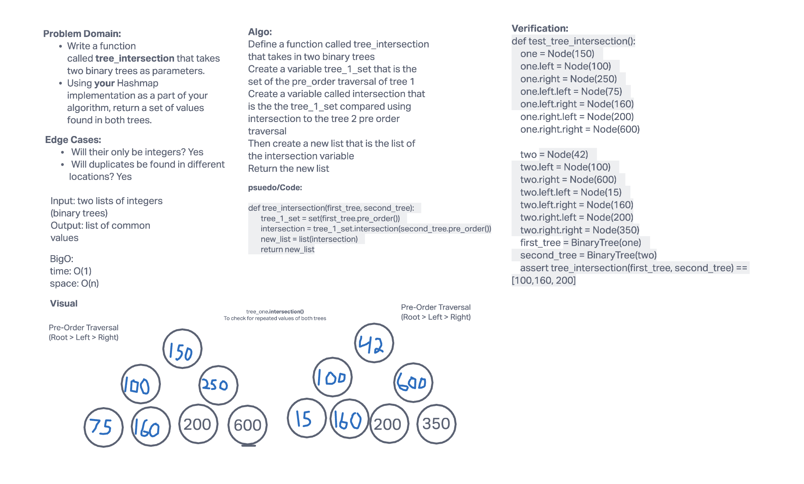

# Tree Intersection
<!-- Short summary or background information -->
Using a hashmap and a binary tree create a function that will take in two binary trees and return any of the common values

## Challenge
<!-- Description of the challenge -->
Write a function called tree_intersection that takes two binary trees as parameters.
Using your Hashmap implementation as a part of your algorithm, return a set of values found in both trees.

## Whiteboard Process
<!-- Embedded whiteboard image -->

## Approach & Efficiency
<!-- What approach did you take? Why? What is the Big O space/time for this approach? -->
Big O:
Time: O(n)
Space: O(1)

## API
tree_intersection: Will take in two trees convert the first one to a set of the pre_order traversal of the tree. Then it will compare that to the pre_order traversal of the second tree using the intersection method. Finally we will convert that set into a list and return that list

# Credits:
Brandon, Eddie, Connor, Roger,

